# statistics-evaluation-and-nlp

A portfolio of synthetic-data testbeds for evaluating whether the statistical tools behind a modern
data/ML pipeline actually do what people assume they do — each one built around a concrete scenario,
with every guarantee checked against known-truth simulations and explicit confidence intervals rather
than a single number and a "looks right."

## realtor-outreach-ai

A synthetic-data testbed built around a realtor-outreach scenario (cold outbound + a YouTube growth
angle) because it has all three ingredients I wanted to work with: a scarce, expensive human action (an
appointment-setter's phone call), a choice between message variants (which email template to send), and
a tempting shortcut (using an LLM to guess how a lead will react before ever contacting them).

Three notebooks, in order:

1. **`realtor-outreach-ai/notebooks/01_research_foundations.ipynb`** -- the math and simulation
   behind every statistical guarantee used later, each checked against known-truth simulations with
   explicit confidence intervals rather than a single number and a "looks right."
2. **`realtor-outreach-ai/notebooks/02_project_walkthrough_part1.ipynb`** -- builds a synthetic world
   of ~6,000 realtor leads with a *known* latent response surface, a rule-based and an LLM-based
   lead-scoring pass, a randomized 3,000-lead pilot, and a "what would today's dashboard tell you"
   audit.
3. **`realtor-outreach-ai/notebooks/03_project_walkthrough_part2.ipynb`** -- an LLM-based pretest for
   comparing email variants, a head-to-head evaluation of every scoring rule against the known-truth
   uplift, a rigorous test of whether personalizing the email template per lead beats a single best
   one, and a cost breakdown.

The short version of why this is more than a demo: the obvious heuristic for prioritizing calls turns
out to be actively harmful, the dashboard a naive team would ship is a false positive, and the
personalization test comes back honestly negative with a power analysis explaining why. See
`realtor-outreach-ai/README.md` for the statistics behind each of them.

### Papers

- Yadlowsky, Fleming, Shah, Brunskill, Wager, *Evaluating Treatment Prioritization Rules via
  Rank-Weighted Average Treatment Effects*, JASA 120(549), 2025, [arXiv:2111.07966](https://arxiv.org/abs/2111.07966)
  -- **prioritize**: RATE, AUTOC and Qini for grading a scoring rule against the treatment effect it
  actually targets.
- Persson, Schultzberg, Ankargren, *Statistical Foundations of LLM-based A/B Testing: A Surrogacy
  Framework for Human Causal Inference*, [arXiv:2606.17165](https://arxiv.org/abs/2606.17165) (2026)
  -- **pretest**: calibrating an LLM-generated outcome against a small human sample, plus a
  falsification test for when that shortcut isn't safe to trust.
- Li, Brunskill, *A Statistical Test for the Benefits of Personalizing Interventions*, Science 393
  (2026), [arXiv:2607.08951](https://arxiv.org/abs/2607.08951) -- **personalize**: a sample-split test
  (KPT) for whether a per-lead policy beats the single best fixed action, without the optimizer's-curse
  bias of testing on the same data used to pick the policy.

### Key results

| Check | Result |
|---|---|
| Heuristic rule's top-20% call-uplift vs. a random 20% (population truth) | -1.86% vs. +6.32% -- the heuristic actively mistargets |
| RATE AUTOC, heuristic rule vs. oracle uplift, TEST half (bootstrap 95% CI) | rule -3.71pp [-5.88, -1.55] (significantly negative); oracle +4.58pp [1.76, 7.40] |
| Naive dashboard claim ("top decile books 18.2% vs. 9.2%") | 95% CI [-0.2, +21.5]pp -- includes zero, not significant at this sample size |
| LLM pretest, falsification-gated calibrated ATE (GBT) | +1.07pp, 95% CI [-2.83, +4.79]pp -- honest null, not "no effect" |
| KPT vs. naive train-eval on the real pilot | KPT 1.02pp (CI includes 0, p=0.14) vs. naive 1.95pp (biased) vs. true psi = 0.59pp |
| False-positive rate under a constructed no-personalization world | naive 60% vs. KPT ~1%; pilot-size sweep: KPT power 0%->23%, RATE-AUTOC power 27%->100% over 3k->30k leads |

### Figures

| | |
|---|---|
| 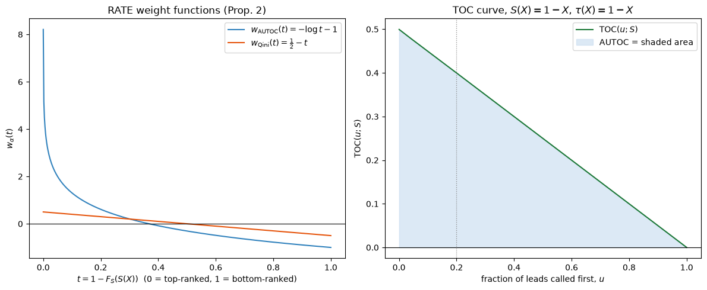<br><sub>The weight functions w_alpha(t) that turn a TOC curve into a single rank-weighted effect, with the area shaded.</sub> | 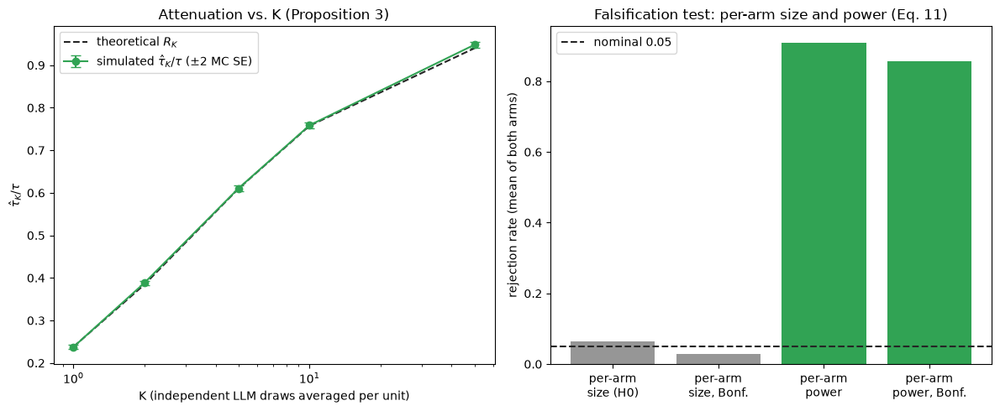<br><sub>tau-hat/tau vs number of LLM draws K, Monte Carlo estimate matched against the theoretical R_K curve.</sub> |
| 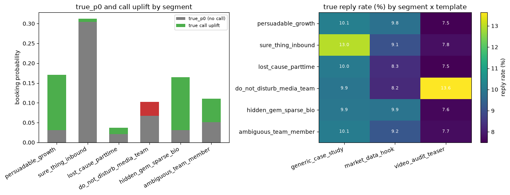<br><sub>Baseline booking and call uplift by latent segment, next to the template x segment reply-rate heatmap.</sub> | 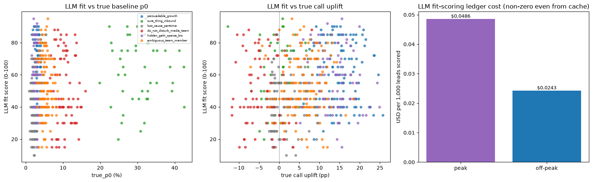<br><sub>LLM lead-fit score vs. true baseline booking and vs. true call uplift, colored by segment -- fit tracks baseline more than uplift.</sub> |
| 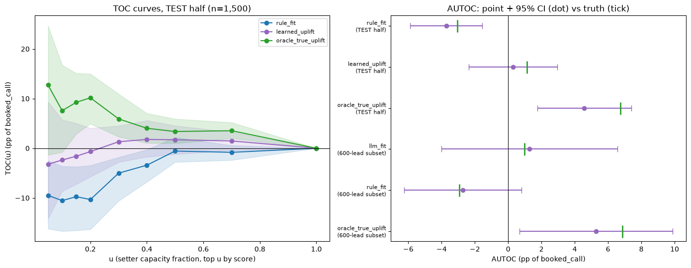<br><sub>TOC curves with bootstrap bands per scoring rule, and the AUTOC/Qini forest plot with population-truth markers -- the heuristic rule is significantly negative, the oracle significantly positive.</sub> | 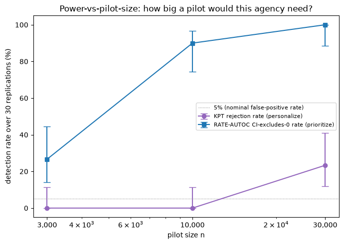<br><sub>KPT and RATE-AUTOC rejection rate vs. randomized-pilot size -- how much bigger a pilot the personalization question needs.</sub> |

<details>
<summary>Layout &amp; running it</summary>

```
realtor-outreach-ai/
├── notebooks/
│   ├── 01_research_foundations.ipynb
│   ├── 02_project_walkthrough_part1.ipynb
│   └── 03_project_walkthrough_part2.ipynb
├── data/
│   ├── pilot_leads.csv      # 3,000-row randomized pilot, with latent ground-truth columns
│   └── new_leads.csv        # 400 fresh leads used by the notebook-3 pretest
├── figures/                 # 6 PNGs embedded above, plus captions.json
└── README.md                # in-depth notes: the statistics behind each notebook, the math
```

```bash
cd realtor-outreach-ai
python -m venv .venv && source .venv/bin/activate
pip install jupyter nbconvert numpy pandas scipy scikit-learn matplotlib pydantic requests

# a DeepSeek API key is only needed to regenerate the LLM-scored cells from scratch;
# set DEEPSEEK_KEY in your environment first if you want a live (uncached) run
cd notebooks
jupyter nbconvert --to notebook --execute --inplace --ExecutePreprocessor.timeout=1800 \
  01_research_foundations.ipynb 02_project_walkthrough_part1.ipynb 03_project_walkthrough_part2.ipynb
```

Notebooks 2 and 3 read/write a small on-disk cache under `data/llm_cache/`, so a second run of the
same cells costs nothing and makes no live API calls. All data here is synthetic, generated by a
seeded simulator with a known ground-truth response surface -- there is no real customer, lead, or
company data anywhere in this repository.

</details>

## alignment-post-training

A synthetic-data research testbed for deciding whether post-training data will move a model strongly, in the right
direction where it matters, and without unintended likelihood displacement. It connects three recent results on reward
variance, high-reward-tail accuracy, and CHES to one trace/rubric/preference-pair audit workflow.

Three notebooks, in order:

1. **`alignment-post-training/notebooks/01_research_foundations.ipynb`** -- derives the core results and checks each
   one numerically, including the reward-variance time bound, rubric-tail theorem, and DPO likelihood-displacement
   derivative.
2. **`alignment-post-training/notebooks/02_project_walkthrough_part1.ipynb`** -- builds a synthetic math-task corpus
   with latent truth, on- and off-policy reasoning traces, weighted rubrics, a noisy verifier, a capped real-verifier
   smoke test, preference pairs, and an accuracy-centric QA baseline.
3. **`alignment-post-training/notebooks/03_project_walkthrough_part2.ipynb`** -- audits that corpus for reward
   variance, tail accuracy, Best-of-N selection effects, high-CHES pairs, and one live toy DPO step on a small model.

The main lesson is that headline verifier accuracy is not enough: reward variance controls signal magnitude, errors in
the high-reward tail control optimization direction, and representation-similar preference pairs can create unwanted
side effects. See `alignment-post-training/README.md` for the paper map, scope, and running instructions.

### Papers

- Razin, Wang, Strauss, Wei, Lee, Arora, *What Makes a Reward Model a Good Teacher? An Optimization Perspective*, NeurIPS 2025, [arXiv:2503.15477](https://arxiv.org/abs/2503.15477) -- **magnitude**: reward variance under the policy caps the policy-gradient signal.
- Zhang, Wang, Gui, et al., *Chasing the Tail: Effective Rubric-based Reward Modeling for LLM Post-Training*, ICLR 2026, [arXiv:2509.21500](https://arxiv.org/abs/2509.21500) -- **direction**: reward misspecification in the high-reward tail dominates.
- Razin, Malladi, Bhaskar, Chen, Arora, Hanin, *Unintentional Unalignment: Likelihood Displacement in Direct Preference Optimization*, ICLR 2025, [arXiv:2410.08847](https://arxiv.org/abs/2410.08847) -- **side effects**: preference pairs with similar hidden embeddings (high CHES) push probability off the preferred response.

### Key results

| Guarantee | Held on this corpus? |
|---|---|
| P2 Proposition 3 time bound (idealised tabular model) | yes -- never violated over 550 reachable toy instances, min observed/bound ratio 1.0039 |
| P3 Theorem 1 closed-form KL and win rate (idealised model) | yes -- matches quadrature and Monte Carlo to <=7.3e-3, all 4 misspecification maps |
| P1 CHES correlates with likelihood displacement (toy embeddings) | yes -- ρ=0.774; the top CHES quintile's mean Δln π(y+) is genuinely negative (-0.100) |
| P2 reward variance on the synthetic client's own verifier rewards | only marginal -- ρ=0.226, p=0.082 at n=60 tasks; right direction, not significant |
| P3 high- vs. low-reward-region tail accuracy on the synthetic rubric | not reproduced -- pooled gap is 0.2pp vs. the paper's own 25.9pp, and the two rubric styles disagree in direction |
| P1 CHES on real preference pairs + one real DPO step (SmolLM2-135M) | yes, small -- near-duplicate/add-verification pairs rank higher in CHES (71.6 vs. 33.3 percentile); Spearman(CHES, -Δln π(y+))=0.621, p<0.001 |

### Figures

| | |
|---|---|
| 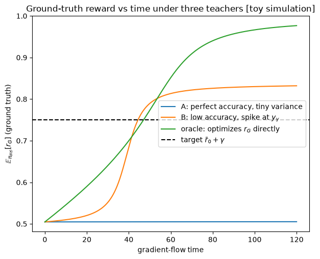<br><sub>A perfect-accuracy reward model stalls while a poorly-ranked one reaches the target fastest -- accuracy alone does not predict speed (Theorem 5).</sub> | 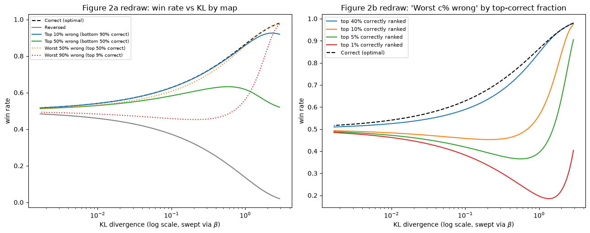<br><sub>Win rate vs KL under four misspecification maps -- getting the top of the quality range wrong costs win rate fast.</sub> |
| 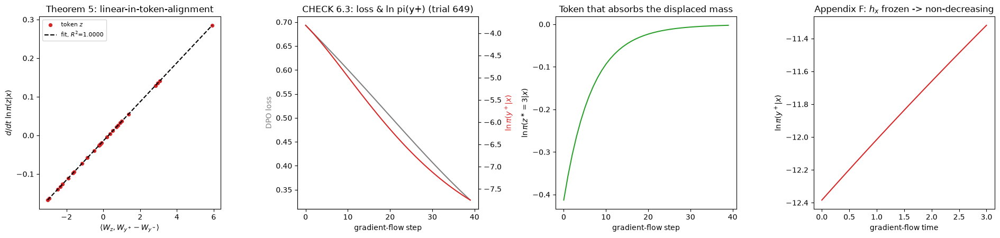<br><sub>Linear fit (R^2=1.0000), the loss falling with ln pi(y+), the token that absorbs the displaced mass, and the frozen-embedding control.</sub> | 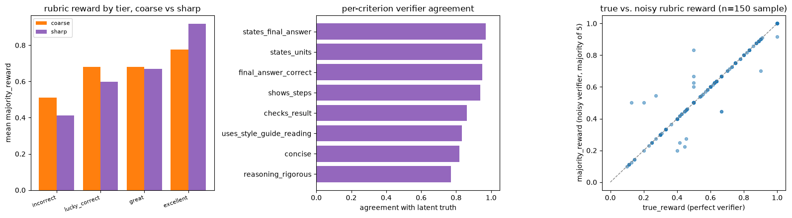<br><sub>Coarse vs sharp rubric reward by tier, per-criterion verifier agreement, and true vs noisy reward over 150 responses.</sub> |
| 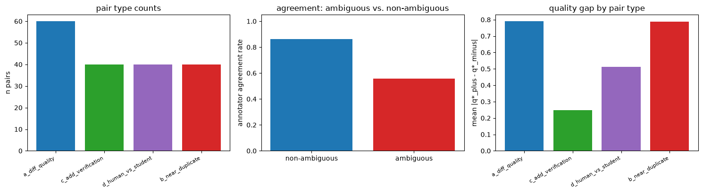<br><sub>Pair-type counts, annotator agreement (lower on ambiguous tasks), and quality gap by pair type.</sub> | 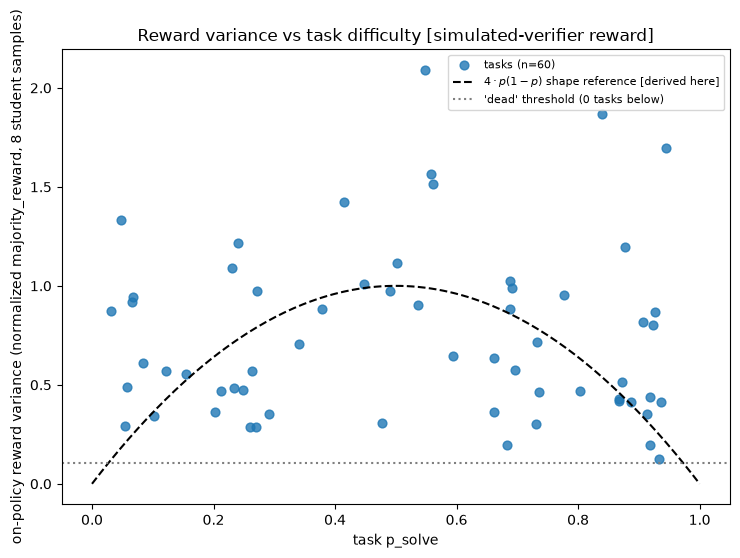<br><sub>On-policy reward variance vs p_solve against the idealised p(1-p) shape -- only marginally significant on real rubric rewards.</sub> |
| 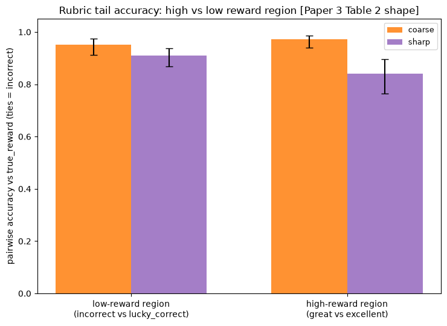<br><sub>Pooled gap is small and the two rubric styles disagree on direction -- not a reproduction of Paper 3's larger gap.</sub> | 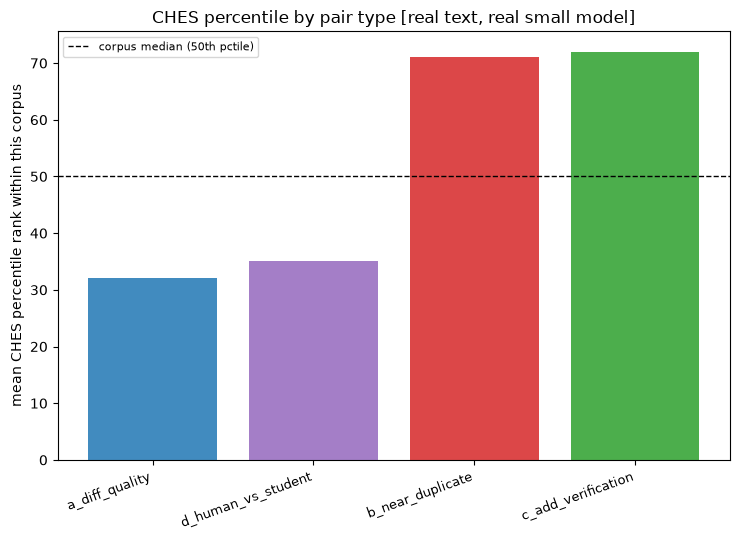<br><sub>Near-duplicate and verification-added pairs rank well above the corpus median in CHES, on a real model.</sub> |
| 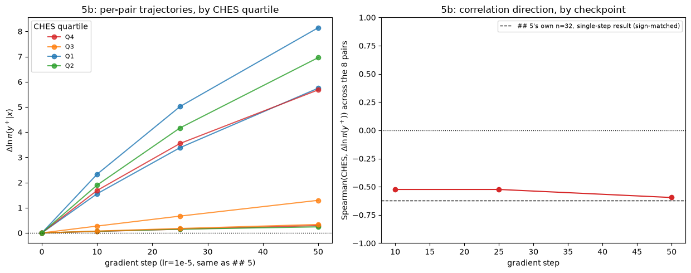<br><sub>An n=8, Colab-prototyped check: the CHES-vs-growth correlation stays negative across checkpoints, matching the main result's sign.</sub> | |

<details>
<summary>Layout &amp; running it</summary>

```
alignment-post-training/
├── notebooks/
│   ├── 01_research_foundations.ipynb
│   ├── 02_project_walkthrough_part1.ipynb
│   └── 03_project_walkthrough_part2.ipynb
└── README.md
```

```bash
cd alignment-post-training
python -m venv .venv && source .venv/bin/activate
pip install jupyter nbconvert numpy pandas scipy matplotlib torch transformers
jupyter nbconvert --to notebook --execute --inplace --ExecutePreprocessor.timeout=1800 \
  notebooks/01_research_foundations.ipynb \
  notebooks/02_project_walkthrough_part1.ipynb \
  notebooks/03_project_walkthrough_part2.ipynb
```

The corpus and stored outputs are synthetic. A `DEEPSEEK_KEY` is needed only to regenerate Notebook 2's small verifier
smoke test when no local cache exists.

</details>

## face-redaction

A research-grounded, synthetic-data testbed for an unattended egocentric-video
face-redaction pipeline. It asks the question that matters before footage is
released: how can a 99% per-face-instance recall claim, alongside a precision
target and processing-cost constraint, actually be justified rather than
assumed?

Three notebooks, in order:

1. **`face-redaction/notebooks/01_research_foundations.ipynb`** — works through Learn then Test, sequential conformal object detection, and finite-sample coverage audits, with synthetic checks of the relevant calculations.
2. **`face-redaction/notebooks/02_project_walkthrough_part1.ipynb`** — builds a known-truth egocentric-video simulator, measures a baseline detector plus tracking/padding trade-offs, and explains why an all-zero-face sample proves no recall claim.
3. **`face-redaction/notebooks/03_project_walkthrough_part2.ipynb`** — selects and audits configurations on disjoint synthetic splits, contrasts guarantees, stress-tests the result, and reports cost and re-verification evidence.

The result is deliberately not a production-success claim: no configuration
certifies the client’s 99% recall and 95% precision targets on this synthetic
setup. That negative result becomes an actionable staged-capture and audit
protocol. See `face-redaction/README.md` for scope, evidence, limitations, and
how to rebuild the notebooks.

<details>
<summary>Layout &amp; running it</summary>

```
face-redaction/
├── notebooks/
│   ├── 01_research_foundations.ipynb
│   ├── 02_project_walkthrough_part1.ipynb
│   └── 03_project_walkthrough_part2.ipynb
└── README.md
```

```bash
cd face-redaction
python -m venv .venv && source .venv/bin/activate
pip install jupyter nbconvert numpy pandas scipy matplotlib opencv-python-headless scikit-image imageio-ffmpeg nbclient
python tools/build_nb1.py && python tools/build_nb2.py && python tools/build_nb3.py
jupyter nbconvert --to notebook --execute --inplace --ExecutePreprocessor.timeout=3000 \
  notebooks/01_research_foundations.ipynb \
  notebooks/02_project_walkthrough_part1.ipynb \
  notebooks/03_project_walkthrough_part2.ipynb
```

</details>

## growth-experiments

A synthetic SaaS growth laboratory for a founder-led B2B SaaS: which headline ideas deserve human traffic, how to
measure a fixed A/B test without invalidating inference through daily peeking, and how to adapt traffic across
several variants without hiding the resulting uncertainty.

Three notebooks derive and Monte-Carlo-verify each guarantee, build a synthetic SaaS funnel with a known latent
truth and audit the founder's naive daily-peeking practice against it, then apply all three methods -- screen,
measure, iterate -- through three independent mock-production entry points. See `growth-experiments/README.md` for
the paper map and limitations, and `growth-experiments/notebooks/README.md` for a per-notebook synopsis.

### Papers

- Persson, Schultzberg, Ankargren (Spotify), *Statistical Foundations of LLM-based A/B Testing*, [arXiv:2606.17165](https://arxiv.org/abs/2606.17165) -- **screen**: LLM-surrogate calibration and a falsification test.
- Lindon, Ham, Tingley, Bojinov, *Anytime-Valid Inference in Linear Models and Regression-Adjusted Causal Inference*, [arXiv:2210.08589](https://arxiv.org/abs/2210.08589) (JASA 2026) -- **measure**: a regression-adjusted confidence sequence valid under daily peeking.
- Liang & Bojinov, *An Experimental Design for Anytime-Valid Causal Inference on Multi-Armed Bandits*, [arXiv:2311.05794](https://arxiv.org/abs/2311.05794) -- **iterate**: the Mixture Adaptive Design.

### Key results

| Check | Result |
|---|---|
| Lindon's delayed-start minimum n (alpha = 0.05), g = 1e4 / 1e2 | reproduced exactly: 247 / 27 |
| MAD time-uniform coverage vs. the unmixed standard bandit | 0.96-0.99 vs. 0.42 |
| Founder's daily-peek baseline, A/A false-positive rate | 0.284 |
| Regression-adjusted CS applied to the same A/A test | 0/150 false positives; adjustment narrows the band only 0.4% at this traffic |
| LLM screen on 18 generated headlines | weak -- Spearman 0.36 with true rates; falsification test flagged both calibrators |
| 4-arm MAD, screened slate vs. always-champion | about +10 signups per 1,000 visitors, driven by one headline above the champion |

### Figures

| | |
|---|---|
| 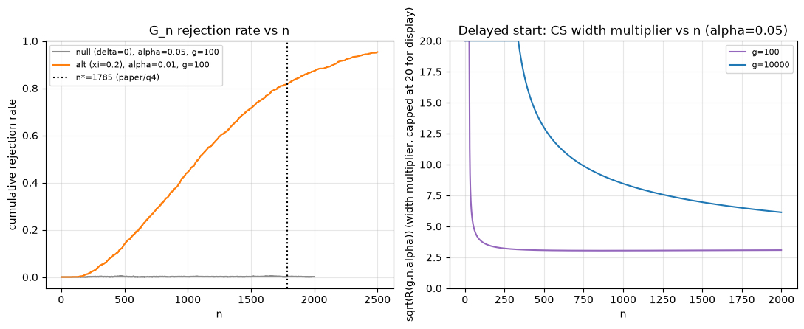<br><sub>The g-prior e-process's rejection rate and its confidence sequence's delayed start, both reproducing the paper's numbers.</sub> | 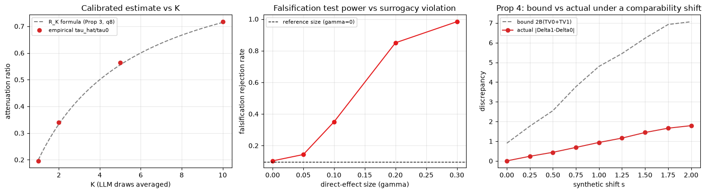<br><sub>More LLM draws buy back attenuation bias along the paper's own R_K curve; the falsification test and sensitivity bound both behave as claimed.</sub> |
| 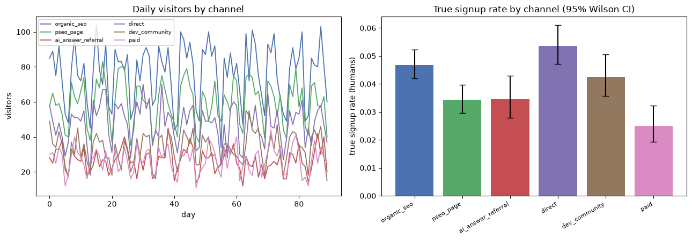<br><sub>The synthetic funnel's daily traffic and true per-channel signup rate, with a known latent truth.</sub> | 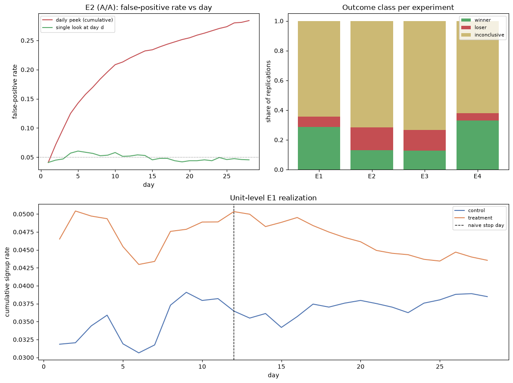<br><sub>The founder's daily-peek policy: a 28% false-positive rate on an A/A test, and outcome classes across four experiments.</sub> |
| 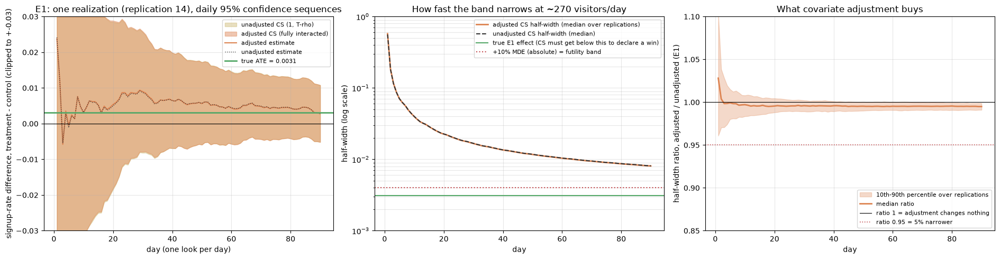<br><sub>One E1 realization's confidence sequence, how fast it narrows, and what covariate adjustment actually buys at this traffic.</sub> | 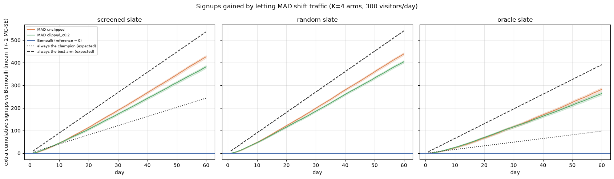<br><sub>Cumulative signups gained by letting the Mixture Adaptive Design shift traffic, across three headline slates.</sub> |

## idp-fintech

A synthetic-data research scaffold for a fintech document-extraction pipeline that can decide which field values to
auto-accept, which to route to review, and what its confidence threshold actually guarantees. It connects conformal
FDR selection, selective-risk control, and a document-extraction validity ladder to invoices, bank statements, KYC
forms, and compliance reports.

Three notebooks derive the guarantees, construct and audit a synthetic 3,500-document corpus with a cached DeepSeek
smoke test, then apply field-, document-, and document-type-level acceptance policies under clustering and month-seven
shift. The result is intentionally a portfolio scaffold, not a production-accuracy claim: its useful output is a
reproducible calibration, review, and re-verification protocol. See `idp-fintech/README.md` for methods, measured
synthetic findings, limits, and how to run it.

### Papers

- Jin & Candès, *Selection by Prediction with Conformal p-values*, JMLR 24(244), 2023, [arXiv:2210.01408](https://arxiv.org/abs/2210.01408) -- **certify**: FDR-controlled selection.
- Bai & Jin, *Conformal Selective Prediction with General Risk Control*, [arXiv:2603.24704](https://arxiv.org/abs/2603.24704) (2026) -- **price**: bounded-risk e-values (MDR/SDR).
- Gurram, *Valid Per-Field Selective Risk Control for Document Extraction*, [arXiv:2608.14639](https://arxiv.org/abs/2608.14639) (2026) -- **hold**: failure modes and a PAC validity ladder for documents.

### Key results

| Guarantee | Held on this corpus? |
|---|---|
| cfBH FDR at the document unit (q = 0.10) | yes -- 0.099 realized vs. q = 0.10 |
| SCoRE-MDR, amount-weighted loss (α = 0.10) | yes -- 0.099, but per-doc loss (0.129) shows MDR is a budget, not a rate |
| Mondrian LTT (PAC, δ = 0.10) | yes with a strong score (0.62 coverage); near-empty with a weak one |
| Month-7 vendor shift, label-free reweighting | only partly -- exact under known covariate shift, but month 7 is partly concept shift, so estimated weights overshoot (MDR 0.185); ~200 labelled docs restore validity |
| Per-document PAC (tier 4), per document type | Hoeffding certifies nothing; a derived-here Bernstein bound certifies 0.45-0.49 within budget |

### Figures

| | |
|---|---|
| 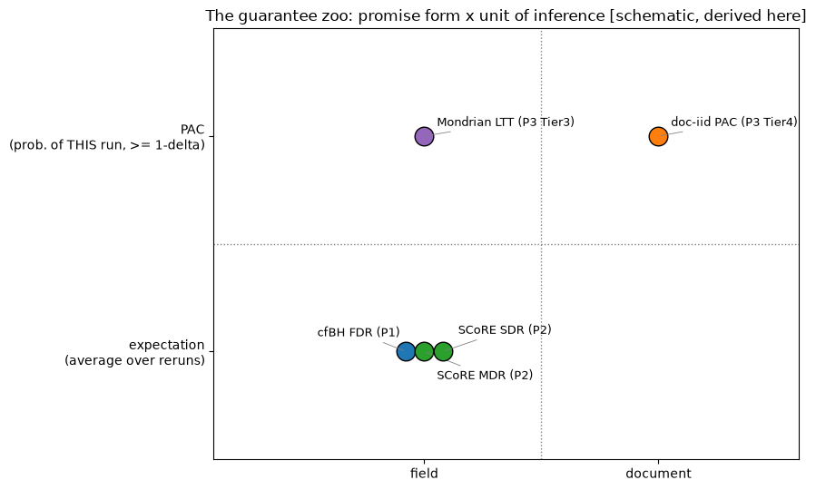<br><sub>Five guarantees, two axes: expectation vs. PAC, field vs. document.</sub> | 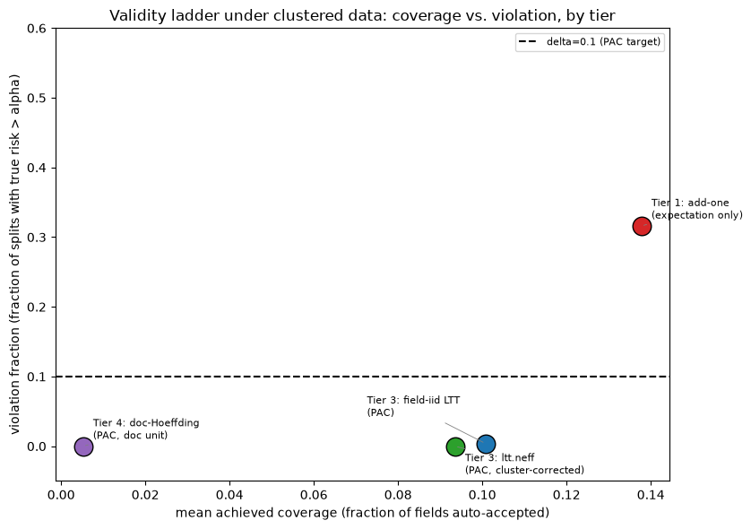<br><sub>Coverage vs. violation from the add-one rule down to PAC tiers.</sub> |
| 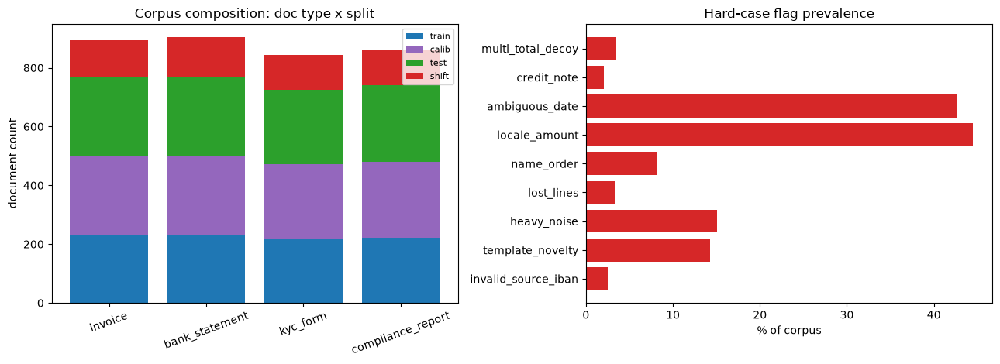<br><sub>3,500 documents, four types, deliberately hard cases.</sub> | 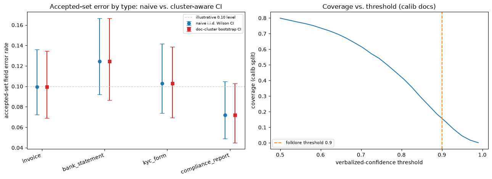<br><sub>The client's likely policy, audited with cluster-aware intervals.</sub> |
| 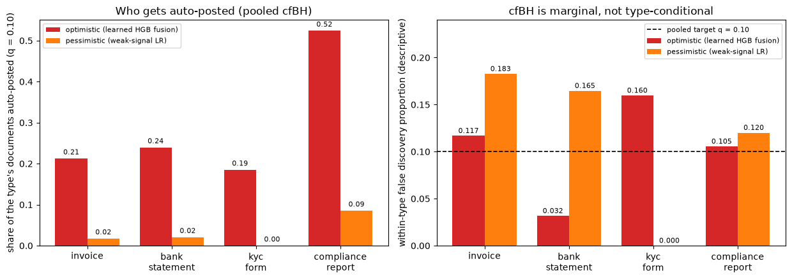<br><sub>Which document types get auto-posted; FDR is marginal, not per-type.</sub> | 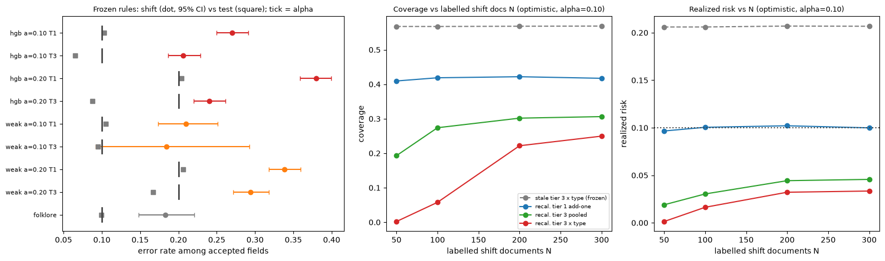<br><sub>A frozen threshold breaks on new vendors; relabelling recovers it.</sub> |

## nlp-job

A synthetic-data testbed built around a hybrid text-classification pattern: cheap keyword-taxonomy
rules plus an LLM fallback tier for whatever the rules can't resolve, applied to deciding whether a job
posting genuinely involves substantive GenAI/LLM work as opposed to buzzwords, mere tool use, or
classic non-generative ML/NLP.

Three notebooks, in order:

1. **`nlp-job/notebooks/01_research_foundations.ipynb`** -- the math behind every statistical
   guarantee used later (prediction-powered inference, a model-cascade certification statistic, and an
   anytime-valid drift monitor), each verified against known-truth simulations.
2. **`nlp-job/notebooks/02_project_walkthrough_part1.ipynb`** -- builds a synthetic corpus of 4,800
   job postings with a *known* latent ground truth, a rule-based scorer, a real LLM classification tier,
   and an audit baseline against a simulated human-labeled sample.
3. **`nlp-job/notebooks/03_project_walkthrough_part2.ipynb`** -- certified routing between the rules
   and the LLM, a prediction-powered evaluation of monthly accuracy from a small human audit, a
   harmful-vs-harmless drift monitor, near-duplicate dedup, and a cost breakdown.

The short version of why this is more than a demo: the rule tier gets a quarter of postings wrong in a
way that's concentrated on specific failure modes, moving the rule/LLM routing boundary is a real
measurable cost/accuracy trade rather than a guess, and the drift monitor correctly tells apart a
harmless change in the data from an actual accuracy drop. See `nlp-job/README.md` for the project pitch,
and `nlp-job/research-notes/` for the statistics behind each result below.

### Papers

- Angelopoulos, Bates, Fannjiang, Jordan, Zrnic, *Prediction-Powered Inference*, Science 382(6671),
  2023, [arXiv:2301.09633](https://arxiv.org/abs/2301.09633) -- **measure**: a rectified estimator and
  confidence interval that stays valid no matter how bad the auxiliary predictor is.
- Zeighami, Shankar, Parameswaran, *Cut Costs, Not Accuracy: LLM-Powered Data Processing with
  Guarantees*, SIGMOD 2026, [arXiv:2509.02896](https://arxiv.org/abs/2509.02896) -- **decide**: an
  anytime-valid betting statistic that certifies a cheap-model cascade threshold against an expensive
  oracle, with a proven impossibility result for rare-positive recall targets.
- Zhang, Cai, Yu, Simeone, *Prediction-Powered Risk Monitoring of Deployed Models for Detecting Harmful
  Distribution Shifts*, ICML 2026, [arXiv:2602.02229](https://arxiv.org/abs/2602.02229) -- **monitor**:
  a semi-supervised anytime-valid test for a *harmful* rise in running risk, not just any distribution
  change.

### Key results

| Check | Result |
|---|---|
| Rules(+fallback) vs. LLM total errors, all 4,800 postings | 1,513 vs. 39 -- rules' worst class 100% error rate (C_genai_implicit, plain-language GenAI work); LLM's worst class 10.8% |
| Boundary sweep, rule threshold hi=4 (current) -> hi=12 | pipeline error 14.2% -> 4.6%, share routed to the LLM 26.3% -> 39.2% |
| Audit n=300 vs. true population (Wilson 95% CI) | precision 0.576 [0.456, 0.688] vs. true 0.606 (covered); recall 0.745 [0.611, 0.845] vs. true 0.793 (covered) |
| BARGAIN certified routing on the real pipeline (T=0.9, delta=0.1) | empirical failure rate 1.5% over 200 runs, but the rule score's poor calibration lets it safely answer only ~8% of postings on its own |
| PPI mean CI width vs. classical, by predictor (100-label monthly audit) | LLM label: 0.48x; noisier end-to-end pipeline label: 1.06x, near PPI's own break-even |
| PPRM: harmless buzzword wave vs. a simulated LLM-tier outage | 0% of streams alarmed (harmless) vs. 100% alarmed (harmful), median step 803 vs. 1,036 for a labels-only monitor |

### Figures

| | |
|---|---|
| 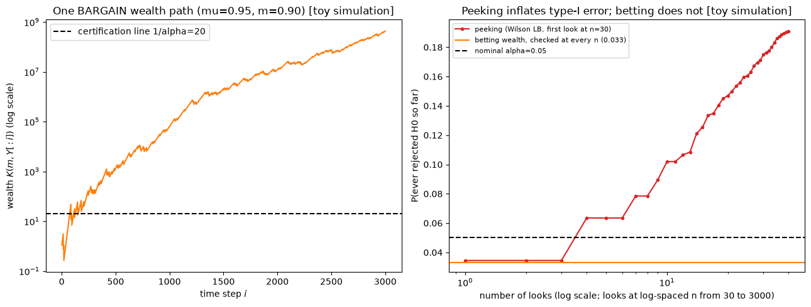<br><sub>A betting-wealth path crossing its certification line, next to the same statistic vs. naive repeated-CI peeking -- peeking inflates false rejections to 19.1%, betting stays at 3.3%.</sub> | 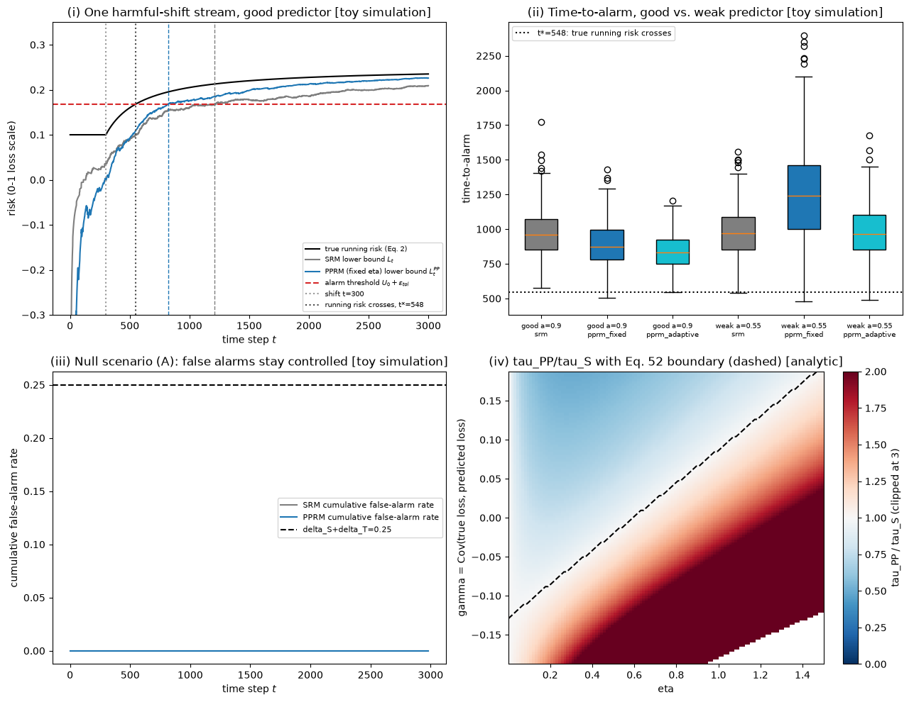<br><sub>Running-risk stream with SRM/PPRM lower bounds, time-to-alarm by predictor quality, null false-alarm control, and the analytic tau_PP/tau_S delay-ratio heatmap.</sub> |
| 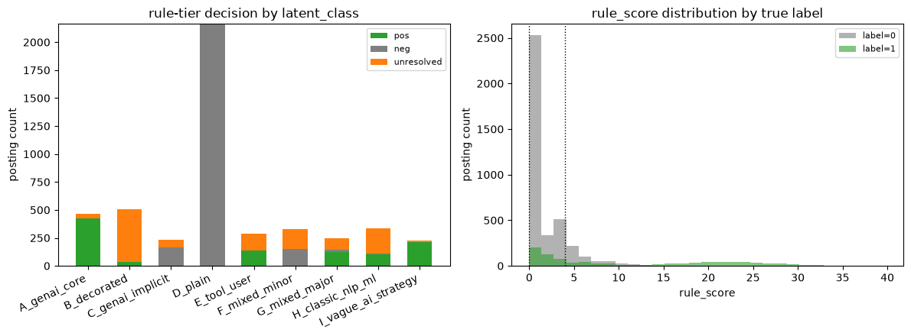<br><sub>Rule-tier decision by latent class next to the rule-score histogram split by true label -- where the keyword taxonomy can and can't separate signal from decoration.</sub> | <br><sub>Pipeline error rate vs. share of postings routed to the LLM, swept over the rule threshold -- a measured cost/accuracy curve.</sub> |
| 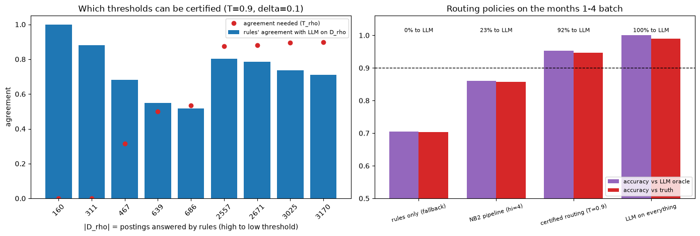<br><sub>Which cascade thresholds BARGAIN can certify, and the resulting accuracy of four routing policies against both the LLM oracle and the known truth.</sub> | <br><sub>Silent on a harmless buzzword wave, alarms on every simulated LLM-tier outage, faster than a labels-only monitor.</sub> |

<details>
<summary>Layout &amp; running it</summary>

```
nlp-job/
├── notebooks/
│   ├── 01_research_foundations.ipynb
│   ├── 02_project_walkthrough_part1.ipynb
│   ├── 03_project_walkthrough_part2.ipynb
│   └── README.md            # notebook-by-notebook technical notes
├── research-notes/          # the statistics behind it: intuition, formalism, where it's applied
├── figures/                 # 6 PNGs embedded above, plus captions.json
└── data/                    # on-disk LLM response cache (regenerates on first run)
```

```bash
cd nlp-job/notebooks
uvx --python 3.12 --from nbconvert --with ipykernel --with numpy --with matplotlib --with pydantic \
  jupyter-nbconvert --to notebook --execute --inplace --ExecutePreprocessor.timeout=1800 \
  01_research_foundations.ipynb 02_project_walkthrough_part1.ipynb 03_project_walkthrough_part2.ipynb
```

A DeepSeek API key is only needed to regenerate the LLM-scored cells from scratch; set `DEEPSEEK_KEY`
in your environment first if you want a live (uncached) run. All data here is synthetic -- there is no
real employer, posting, or company data anywhere in this repository.

</details>

## sports-betting-edge

A simulation-based mock project on finding a provable sports-betting edge among many candidate signals without
fooling yourself: a subscription betting business has 40 candidate signals (referee tendencies, rest and travel,
recent form), a folder of backtests that all look good, and no way to tell which edges are real, which are luck, and
which are bugs.

Four notebooks, in order:

1. **`sports-betting-edge/notebooks/01_research_foundations.ipynb`** -- derives and Monte-Carlo-verifies every
   guarantee the pipeline relies on: anytime-valid confidence sequences and e-processes (Choe and Ramdas), online
   false-discovery-rate control under arbitrary dependence (e-LOND, Xu and Ramdas), and calibeating (Chen, Huang,
   Jordan and Luo).
2. **`sports-betting-edge/notebooks/02_mock_project_part1_build.ipynb`** -- the project brief and acceptance
   criteria, a synthetic-data simulator with a *known* latent truth (4 real edges, a look-ahead bug, correlated
   proxy signals, a decaying edge), the frozen forecasters, and an audit of the client's naive screen-and-stack
   pipeline over 200 simulated worlds.
3. **`sports-betting-edge/notebooks/03_mock_project_part2_prove_screen_combine.ipynb`** -- a two-stage certified
   registry, a combined forecaster, a decay monitor, a money view, and a scorecard against all four criteria.
4. **`sports-betting-edge/notebooks/04_paper_reproductions.ipynb`** -- re-runs the two papers that have experiments
   against their own published numbers: the Choe and Ramdas MLB analysis and the Xu and Ramdas local-dependence
   simulation.

The short version of why this is more than a demo: the naive pipeline's false-discovery proportion is 18.9% against
a 10% target and it publishes the look-ahead bug in 95.5% of worlds, the certified two-stage registry drives both to
zero at a real cost in power, and no valid monitor can flag a decaying edge as fast as the client wants -- the
notebook reports the criterion as written (not met) next to a revised, disclosed horizon (met) instead of hiding either. The confidence-sequence code was checked against the
papers' own numbers (below); that check exposed and fixed a tuning-constant bug, and Notebooks 1 and 3 were re-run.

### Papers

The pipeline is built from three papers, one per pipeline step:

- Y. J. Choe and A. Ramdas, *Comparing Sequential Forecasters*, Operations Research 72(4):1368-1387, 2024, [arXiv:2110.00115](https://arxiv.org/abs/2110.00115) -- **Prove**: anytime-valid confidence sequences and e-processes for the score gap between two forecasters.
- Z. Xu and A. Ramdas, *Online multiple testing with e-values*, AISTATS 2024 (PMLR 238), [arXiv:2311.06412](https://arxiv.org/abs/2311.06412) -- **Screen**: e-LOND, online false discovery rate control under arbitrary dependence.
- Y. Chen, Z. Huang, M. I. Jordan and H. Luo, *Calibeating Made Simple*, [arXiv:2603.22167](https://arxiv.org/abs/2603.22167) (2026, theory only, no experiments) -- **Combine**: calibeating and multi-calibeating (Hedge over calibrated forecasts).

### Key results

Guarantees verified in Notebook 1, by Monte Carlo: the confidence sequence gives time-uniform coverage of the score gap, $P(\forall t: \Delta_t \in C_t) \ge 1-\alpha$;
e-LOND keeps $\mathrm{FDR}(R_t) \le \alpha$ at every step under arbitrary dependence between signals; and calibeating bounds the aggregate loss against the
best single forecaster's refinement score to within $O(\log N + |Q|\log T)$, against an oblivious adversary. Notebook 3 then scores the client's four
acceptance criteria, computed by code from 200 simulated worlds:

| Acceptance criterion | Naive pipeline (screen at p < 0.05, stack winners) | Certified pipeline (this project) |
|---|---|---|
| **AC1**: false-discovery proportion among published signals <= 10% | 0.189, **not met** | 0.000, **met**<br>*What it is:* the mean, over 200 worlds, of false discoveries divided by signals published; its bootstrap 95% interval is [0.000, 0.000] because every world's value is 0.<br>*What is behind it:* about 478 signals were published (2.39 per world; 179 of the 200 worlds published at least one) and none was false. That is 0 of 200 worlds with a false discovery, so the one-sided 95% (Clopper-Pearson) upper bound on the share of such worlds is 1.5% (about 0.6% per published signal), against the e-LOND target of 10%. The theorem is an upper bound, so 0.000 is a measurement, not a claim that the true rate is exactly zero.<br>*Why it is so low:* a signal is published only if its stage-2 e-value is at least 1/alpha = 10, and the 30 no-effect signals' e-values averaged 0.68 with a maximum of 2.92 over 6,000 signal-worlds. The price is power: 35% of the real edges are published.<br>*It is not a degenerate statistic:* the same measure gives 0.189 for the naive screen and 0.360 for a single-stage e-LOND (0.098 with the paper's default discounting). |
| **AC2**: the look-ahead signal is published in <= 1% of worlds | 95.5% of worlds, **not met** | 0 of 200 worlds, **met** (observed share 0.000 <= 0.01)<br>*What the zero supports:* the Wilson 95% upper bound is 1.9% and the exact one-sided (Clopper-Pearson) upper bound is 1.5%. Zero events prove a rate below 1% at 95% confidence only from at least 299 worlds (exact) or 381 (Wilson), so 200 worlds cannot show the 1% bound tightly; the observed zero supports a true rate below about 1.5% to 1.9%, not below 1%.<br>*It is not because the signal was never considered:* stage 1 (the backtest, where the leak is present) shortlists the look-ahead signal in 94.5% of worlds (about 189 of 200). Stage 2 judges it on live seasons, where the leak is absent and its exact gap is negative (-13.1e-4 Brier per game on the fresh live window), and its confidence sequence never excluded zero from below in any of the 200 worlds.<br>*Without stage 2 it gets through:* a backtest-only e-LOND publishes it in 49.5% of worlds (flat discounting; 12.5% with the paper's default) and the naive screen in 95.5%. |
| **AC3**: the combined forecast is not worse than the market by a valid interval (lower end >= -5e-4) | mean lower end -1.55e-4, **met** | mean lower end -0.93e-4, **met** |
| **AC4** (revised horizon): a decaying edge is flagged within 14,760 games (12 seasons) in at least half of worlds, with <= 5% false alarms | flagged 0.730, but false alarms 0.121, **not met** | flagged 0.570 (95% Wilson interval 0.501 to 0.637), false alarms 0.0006, **met** |

**AC4 as written in Notebook 2 (within 3,690 games, three seasons) is not met by either pipeline**: the naive dashboard flags 0.210 of worlds (with 12.1% false alarms) and the certified monitor 0.025. That horizon sits at the ceiling of what
even an oracle fixed-time test can reach (its z-statistic after 3,690 games is about 1.6, so it would flag about half of the worlds), which is why a monitor that must stay valid cannot meet it. It is not only a validity problem:
Notebook 3 (section 6b) also tries twelve fixed-checkpoint z-test monitors with no anytime guarantee, and none meets the written criterion on the 200 audit worlds. The closest flags 0.535 of the worlds but raises false alarms on 5.9% of the genuine
edges (allowance 5%), and the one that stays inside the allowance with the most detection flags 0.385, so detecting the decay within three seasons costs more false alarms than the criterion allows. The revised horizon is the 12 seasons of the
certification window. It was **not** chosen blind, and the order matters: the design constants were compared on prototype worlds disjoint from the audit; a first 200-world audit with the previous monitor level flagged 0.480 within
the revised horizon (not met); because that monitor's false-alarm rate was 0.06% against a 5% allowance, its level was raised to the full one-sided 5% (still an anytime-valid test), checked on 60 further prototype worlds, and the audit was
re-run once, which is the result in the table. The confidence-sequence constant `v_opt` was likewise re-chosen (0.3 to 10) on prototype worlds after the tuning-map fix described below.

### Paper reproductions

Notebook 4 re-runs the papers' own experiments and compares the printed numbers with the papers'. Tolerances were fixed before the comparison.

| Paper result | Paper | This repository | Verdict |
|---|---|---|---|
| Choe and Ramdas, Table 4a: Brier confidence sequence, FiveThirtyEight minus Vegas, MLB 2010 to 2019 (25,165 games) | (-0.00265, -0.00061) | (-0.00265, -0.00061); all four forecasters within 4.8e-6 | **met** |
| Choe and Ramdas, Figure 11: ten pairwise intervals | printed to 3 decimals | 10 of 10 within tolerance | **met** |
| Choe and Ramdas, e-value that Vegas is at least as good as FiveThirtyEight | 2979 | 2979.0 | **met** |
| Choe and Ramdas, first time the interval excludes zero | t >= 10,000 | t = 9,891 (the e-process crosses 40 at the same game, as the duality requires) | **met** |
| Xu and Ramdas, Figure 2: FDR of e-LOND, r-LOND and LORD* at most alpha = 0.3 | yes | max FDR 0.195 over all 20 settings | **met** |
| Xu and Ramdas, Figure 2: e-LOND at least as powerful as r-LOND | yes | equal at the paper's mu1 (both saturate at 1.00); ahead where power is not saturated (0.23 vs 0.12 at mu1 = 1.0, 0.90 vs 0.81 at mu1 = 1.5) | **met** |
| Xu and Ramdas, Figure 2: e-LOND overtakes LORD* at large lag (L >= 250), at the paper's stated mu1 = 3 | yes | **not reproduced**: both reach power 1.00 at every lag, so there is nothing to overtake | **not met** |
| Same crossover in the regime where power is in the paper's range (mu1 = 1.5, an added regime) | yes | LORD* ahead at L = 0 (0.980 vs 0.899); e-LOND ahead at L = 250 (0.894 vs 0.880) and L = 500 (0.897 vs 0.810) | **met** |

The reproduction found a real bug in this repository's first version: the confidence sequence's tuning constant was inverted, which made every interval
too wide (0 of 14 MLB comparisons matched). After the fix all 14 match. The Xu and Ramdas simulation is only partly specified in the paper (the non-null
proportion and the copula details are not stated), and with its stated Beta shape and mu1 of 2.5 or 3 the data are so informative that the e-value methods
saturate, so the paper's power of 0.3 to 0.8 cannot appear. The crossover was therefore also tested at smaller mu1 (1.0 and 1.5), where power lies in that range; that regime
was added after the saturated run, and both results are reported. The run used 100 trials per setting (the paper: 500).

What the numbers say, including the parts that do not flatter the method:

- **A plain backtest is fooled by the bug.** The naive screen publishes the look-ahead signal in 95.5% of worlds; even a single-stage e-LOND on the same backtest
  publishes it in 49.5% with a flat discount sequence (12.5% with the paper's default), because its forecasts are not predictable and the guarantee is void.
  Confirming shortlisted signals on live seasons, where the bug is absent, publishes it in 0 of 200 worlds.
- **Guarantees cost data.** The certified registry publishes about 2.4 signals per world and finds about 35% of the real edges after 12 live seasons (14,760 games).
  Among the worlds where an edge is proven at all, the strongest edge takes a median of about 8,300 live games and the weakest about 13,300 (a reference point: the
  2024 paper's baseball comparison used 25,165 games).
- **Safe is not the same as best.** The naive stack earns a larger Brier gain on fresh seasons (+18.0e-4) than the certified combiner (+8.4e-4), but it carries no
  guarantee and no protection against the bug. Calibeating the market on its own does *not* recover the planted longshot mispricing at this data size (-3.05e-4 against
  an oracle gain of +0.71e-4: rounding to the bin grid and the learning cost outweigh it).
- **AC4 is out of reach as written, and reachable only slowly.** Three seasons (3,690 games) after the decay begins the test statistic is only about 1.6, so even an oracle fixed-time 5% test would detect it in only about half of the worlds.
  The full-history confidence sequence flags 57% of worlds within 12 seasons (median about 12,400 games among the worlds that flag, 89% eventually) with almost no false alarms. The
  notebook shows the trap that a faster rule falls into: restarting a test at a data-chosen point raises false alarms from 13% to 74% for a plain z-test dashboard.
- **A Brier win is not profit.** A sub-vig edge has a real Brier gain and a negative expected return if followed in every game at margined odds (-1.96%).

### Figures

8 of the plots rendered across the four executed notebooks, chosen for what they show about the pipeline as a whole; each caption is condensed from
the notebook's own "How to read this chart" text. All are simulation results (synthetic data) except the MLB reproduction, which re-analyses public data.

**Notebook 1 -- Research foundations** ([`sports-betting-edge/notebooks/01_research_foundations.ipynb`](sports-betting-edge/notebooks/01_research_foundations.ipynb))

| | |
|---|---|
| ![e-LOND FDR under three dependence structures [toy]; Worst case: the guarantee is sharp [toy, derived from App. C]; Power at alpha=0.1: e-LOND dominates [toy]](sports-betting-edge/figures/nb1-04-elond-fdr.png)<br><sub>e-LOND keeps FDR below alpha under independent, banded and adversarial dependence, and reaches the theoretical worst case (alpha * sum gamma_i) exactly on the Appendix C construction.</sub> |  |

**Notebook 2 -- Mock project, part 1: build** ([`sports-betting-edge/notebooks/02_mock_project_part1_build.ipynb`](sports-betting-edge/notebooks/02_mock_project_part1_build.ipynb))

| | |
|---|---|
| 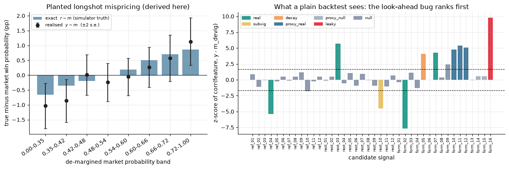<br><sub>The simulator plants a small longshot mispricing and a look-ahead bug; a plain backtest ranks the buggy signal first, ahead of every real edge.</sub> | 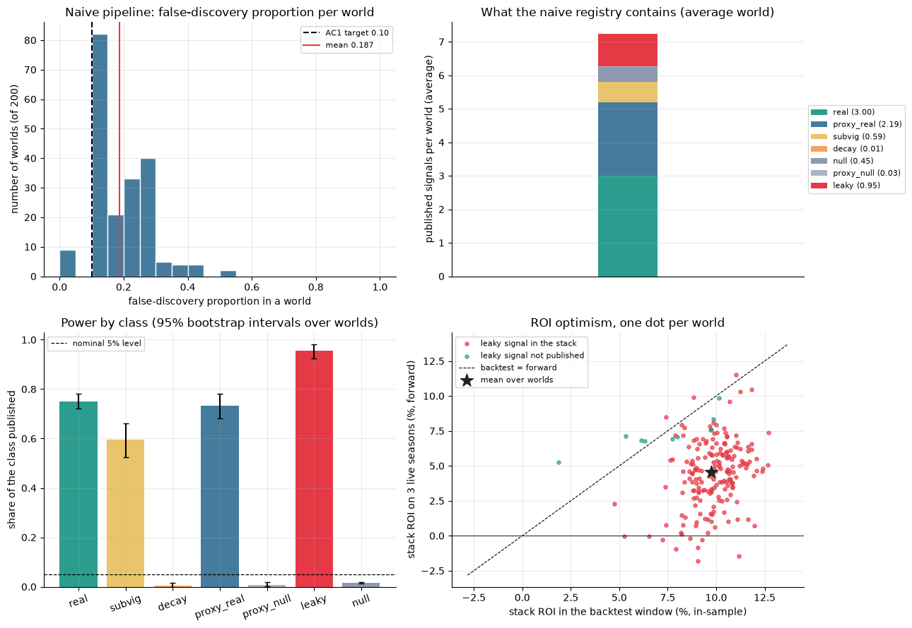<br><sub>Over 200 simulated worlds the naive screen's false-discovery proportion sits at 18.7% against a 10% target, and publishes the look-ahead signal almost every time.</sub> |

**Notebook 3 -- Mock project, part 2: prove, screen, combine** ([`sports-betting-edge/notebooks/03_mock_project_part2_prove_screen_combine.ipynb`](sports-betting-edge/notebooks/03_mock_project_part2_prove_screen_combine.ipynb))

| | |
|---|---|
| 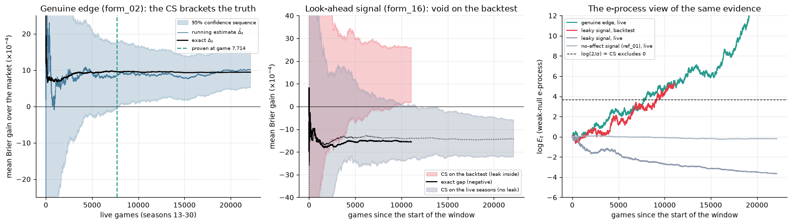<br><sub>A confidence sequence proves a genuine edge within a live season while the look-ahead signal's interval never separates from zero once the bug is absent.</sub> | 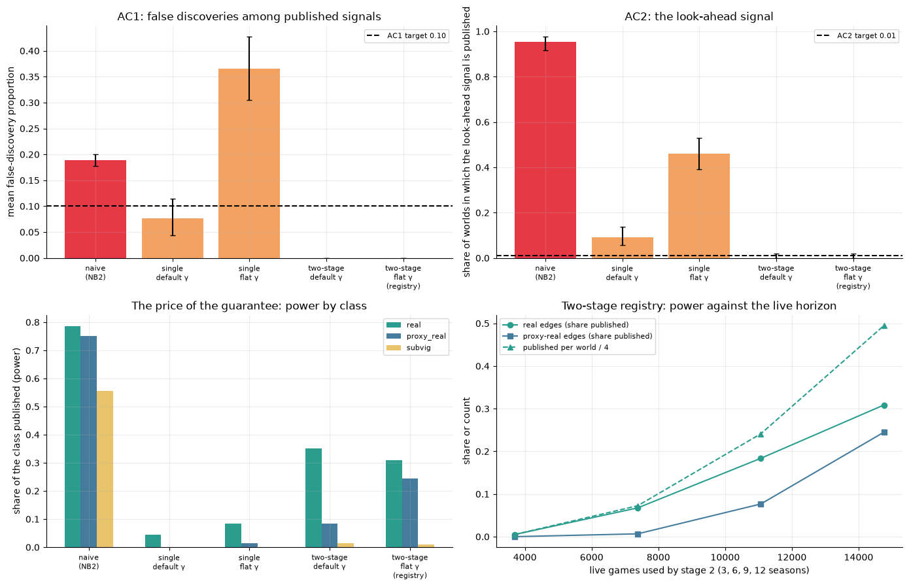<br><sub>The two-stage registry (backtest shortlist, live-season confirmation) drives the false-discovery proportion to zero and keeps the look-ahead signal out, at a cost in power.</sub> |
| 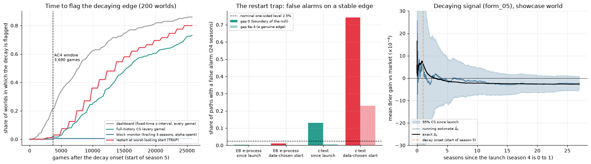<br><sub>No valid monitor flags the decaying edge within the 3,690-game target; the full-history confidence sequence flags 57% of worlds within 12 seasons, and restarting a test at a data-chosen point inflates false alarms on stable edges.</sub> | 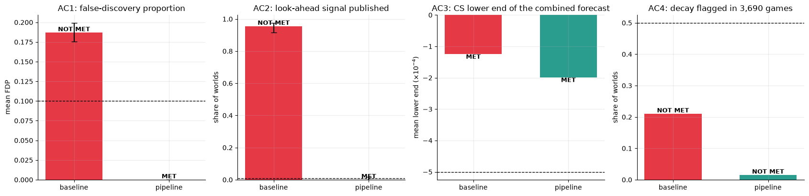<br><sub>The certified pipeline meets AC1-AC4 (AC4 with the revised 12-season horizon; as written, at 3,690 games, it is not met by either pipeline); the naive pipeline fails AC1, AC2 and AC4.</sub> |

**Notebook 4 -- Paper reproductions** ([`sports-betting-edge/notebooks/04_paper_reproductions.ipynb`](sports-betting-edge/notebooks/04_paper_reproductions.ipynb))

| | |
|---|---|
| 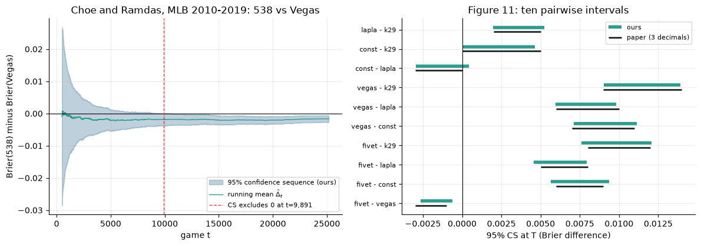<br><sub>Left: the 95% confidence sequence for FiveThirtyEight minus Vegas on 25,165 MLB games separates from zero at game 9,891 (paper: about 10,000). Right: all ten pairwise intervals against the paper's printed values.</sub> |  |

<details>
<summary>Layout &amp; running it</summary>

```
sports-betting-edge/
├── notebooks/
│   ├── 01_research_foundations.ipynb
│   ├── 02_mock_project_part1_build.ipynb
│   ├── 03_mock_project_part2_prove_screen_combine.ipynb
│   ├── 04_paper_reproductions.ipynb
│   └── README.md            # notebook-by-notebook synopsis, text-only
├── figures/                 # 8 PNGs embedded above, plus captions.json
├── results/PROVENANCE.md    # where each notebook was executed
├── requirements.txt
└── README.md                # text-only project notes; papers/results/figures are here instead
```

```bash
cd sports-betting-edge
python -m venv .venv && source .venv/bin/activate
pip install -r requirements.txt
python -m ipykernel install --user --name edgelab --display-name "Python (edgelab)"
cd notebooks
for nb in 01_research_foundations 02_mock_project_part1_build 03_mock_project_part2_prove_screen_combine 04_paper_reproductions; do
  jupyter nbconvert --to notebook --execute --inplace --ExecutePreprocessor.kernel_name=edgelab \
    --ExecutePreprocessor.timeout=3600 "$nb.ipynb"
done
```

Notebooks 1 to 3 use only synthetic data -- there is no real bet, odds feed, or sportsbook data in them. Notebook 4 downloads one public research
file (MLB game forecasts from the Choe and Ramdas authors' repository) at run time and does not store it. No API key is needed anywhere.

</details>
